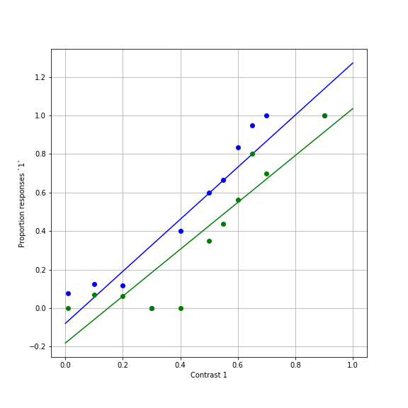

# Linear models.

> ## Learning Objectives {.objectives}
>
> * Learners can identify a linear model.
> * Learners can use `numpy` to fit a linear model to data
> * Learners can evaluate a model using model residuals.

The main distinction we will make in this lesson is between linear models and
non-linear models. Linear models are models that can be described by the
following functional form:

$\bf{y} = \beta_0 + \beta_1 \bf{x}_1 + \beta_2 \bf{x}_2 + ... + \beta_n \bf{x}_n + \epsilon$,

where $\bf{y}$ denotes the dependent variable or variables (that's why it's
bold-faced: it could be a vector!) in your experiment. $\bf{x}_i$ are sets of
dependent variables (also, possibly vectors) and $\beta_i$ are parameters.
Finally, $\epsilon$ is the noise in the experiment. You can also think about
$\epsilon$ as all the things that your model doesn't know about. For example, in
the visual experiment described, changes in participants wakefulness might
affect performance in a systematic way, but unless we explicitely measure
wakefulness and add it as an independent variable to our analysis (as another
$\bf{x}$), we don't know it's value on each trial and it goes into the noise.

All the variables designated as $\beta_i$ are parameters of the model.

### How do we choose $beta_i$?

There are many things you might do to choose the values of the parameters but a
common criterion is to select parameters that reduce the sum of the square
of the errors (SSE) between the model estimate of the dependent variable and the values of the depenedent variable that was measured in the data. That is if:

$SSE = \sum{(y - \hat{y})^2}

where $\hat{y}$ is the model estimate of the dependent variable (the "hat" on
top of the variable indicates that it is estimated through the model, rather
than the one that we measured). Then we will want to find values of the
paraemters $\beta_i$ that bring about the smallest possible value of SSE.

As mentioned before, finding good values for the parameters, $beta_i$ is called
"fitting the model". It turns out that linear models are easy to fit. Under some
fairly generic assumptions (for example that $\epsilon$ has a zero-mean normal
distribution), there is actually an analytic solution to this problem. That is,
you can plug it into a formula and get the exact solution: the set of $\beta_i$
that give you the smallest SSE between the data you collected and the function
defined by the parameters.

> ## Linearized models {.callout}
>
>  Because linear models are easy to fit, if you can transform your data somehow
>  to get it into a linear form, you should definitely do that.

## Fitting a linear model to psychophysics data

Let's fit a linear model to our data. In our case, a linear model would
be a straight line in 2D:

$y = \beta_0 + \beta_1 x$

Where, $\beta_0$ is the intercept and $\beta_1$ is the slope.

This function is a special case of a larger set of functions called
"polynomials" (see below). The `numpy` library contains a function for fitting
these functions, `np.polyfit`

> ## Polynomial functions {.callout}
> This family of functions has the general form:
>
> $\beta_0 + \beta_1 x + \beta_2 x^2 + ... \beta_n x^n$
>
> where we say that the "degree" of the polynomial is the highest non-zero power
> of x that is represented in the function. More formally, it is the highest
> value of n, such that $\beta_n \neq 0$.

The function `np.polyfit` requires three arguments, a vector of x values, a
vector of y values and an integer, signifying the degree of the polynomial we
wish to fit.

~~~ {.python}

beta_ortho = np.polyfit(x_ortho, y_ortho, 1)
beta_para = np.polyfit(x_para, y_para, 1)

~~~

Reading the documentation of polyfit, you will learn that this function returns
a tuple with the beta coefficient values, ordered from the *highest* degree to
the *lowest* degree.

That is, for the linear (degree=1) function we are fitting here, the slope is
the first coeffiecient and the intercept of the function is the second
coefficient in the tuple. To match the notation we used in our equations, we
can assign as:

~~~ {.python}

beta1_ortho = beta_ortho[0]
beta0_ortho = beta_ortho[1]

~~~

> ## Python tuples {.callout}
>
> Python tuples are a lot like lists, they are ordered sets of items arranged
> in order. For example:
>
> `my_tuple = (1, 2, 3)`
>
> The main difference between tuples and lists (you should have seen lists in the [software carpentry python lessons](http://swcarpentry.github.io/python-novice-inflammation/03-lists.html)
> is that the items in lists can be changed after they are allocated, and
> tuples are "immutable"

We can also write the above function as follows, splitting the tuple up as it
comes out of the function:

~~~ {.python}

beta1_ortho, beta0_ortho = np.polyfit(x_ortho, y_ortho, 1)
beta1_para, beta1_para = np.polyfit(x_para, y_para, 1)

~~~

Note that because these values of $\beta$ are not the "true" values of these
coefficients and are just estimates based on the sample we've observed, we
mark them as an estimate by putting a hat on them: $\\hat{beta}$.

The inverse of `np.polyfit` is the function `np.polyval' that takes these values
$\\hat{beta}$ and values of the independent variable (x), and produces estimated
values of the dependent variable: $\hat{y}$, according to the polynomial
function.

We'll estimate this for a broad range of the independent variable, covering the
full range that was in the measurements:

~~~ {.python}
x = np.linspace(0, 1, 100)  # What does linspace do?
y_ortho_hat = np.polyval((beta1_ortho, beta0_ortho), x)
y_para_hat = np.polyval((beta1_para, beta0_para), x)

~~~

Let's visualize the result of this:

~~~ {.python}

fig, ax = plt.subplots(1)
ax.plot(x, y_ortho_hat)
ax.plot(x_ortho, y_ortho, 'bo')
ax.plot(x, y_para_hat)
ax.plot(x_para, y_para, 'go')

ax.set_xlabel('Contrast 1')
ax.set_ylabel('Proportion responses `1`')
ax.grid('on')
fig.set_size_inches([8,8])

~~~

Recall that we wanted to know the value of the PSE for the two conditions. That
is the value of x for which $\hat{y} = 0.5$. For example, for the orthogonal
surround condition:

In this case, we'll need to do a little bit of algebra. We set y=0.5, and solve
for x:

$0.5 = \beta_0 + \beta_1 x$

$ \Rightarrow 0.5 - \beta_0 = \beta_1 x$

$ \Rightarrow x = \frac{0.5- \beta_0}{\beta1}$

Or in code:

~~~ {.python}

pse_ortho = (0.5 - beta0_ortho)/beta1_ortho
pse_para = (0.5 - beta0_para)/beta1_para

~~~

## Evaluating models

How good is the model? Let's look at the model "residuals", the difference
between the model and the measured data:

Recall that we wanted to find parameters that would minimize the sum of the
squared errors (SSE):

~~~ {.python}

residuals_ortho = x_ortho - np.polyval((beta1_ortho, beta0_ortho), x_ortho)
SSE_ortho = np.sum(residuals_ortho ** 2)

residuals_ortho = x_ortho - np.polyval((beta1_ortho, beta0_ortho), x_ortho)
SSE_ortho = np.sum(residuals_para ** 2)

~~~

To summarize: This model seems to capture some aspects of the data rather well.
For one, it is monotonically increasing. And the SSE doesn't seem too bad
(though that's hard to assess just by looking at this number). This model tells
us that the PSE is at approximately 0.43 for orthogonal condition and
approximately 0.56 for the parallel condition. That is, the contrast in the
first interval has to be higher than the contrast in the second interval to
appear exactly the same. By how much? For the orthogonal condition it's about
13% and for the parallel condition it's about 26% (considering that the
comparison contrast is always 30%). This makes sense: more suppression for the
parallel relative to the orthogonal condition.

But there are also a few problems with this model: It seems to miss a lot of the
points. That could be because the data is very noisy, but we can see that the
model systematically overshoot the fit for high values of x and systematically
undershoots for low values of x. If we had more data, we might see this
repeatedly, clueing us in that this is not just a matter of the noise in this
data. This might indicate to us that another model might be better for this
data.

Finally, another problem is that it seems to produce non-sensical values for
some conditions. For example, it sometimes predicts values larger than 1.0 for
large contrasts and values smaller than 0.0 for small contrasts. These values
are meaningless, because proportion of responses can never be outside the range
0-1. We need to find a different model.   
