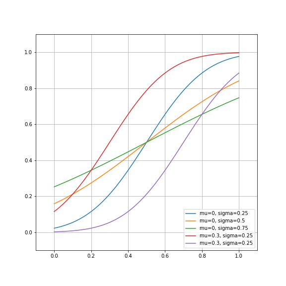

# Non-linear models

> ## Learning Objectives {.objectives}
>
> * Learners can identify a nonlinear model, and discuss the differences between linear and nonlinear models
> * Learners can use `scipy.optimize` to fit a nonlinear model to data.
> * Learners can calculate and display model residuals for nonlinear models

Unfortunately, linear models don't always fit our data. As shown before, they
might produce large and systematic fit error, or they might produce parameter
values that don't make sense. In these cases, we might need to fit a non-linear
model to our data. Non-linear models are mathematically expressed as:

$\bf{y} = f(\bf{x}_1, \bf{x}_2, ... \bf{x}_n, \bf{\beta}) + \epsilon$,

Where $f()$ can be almost any function you can think of that takes $x$'s and
$\beta$'s as input. The problem is that, in contrast to the linear models, there
is no formula that you can just plug your function and data into and derive the
values of the parameters.

One way to find the value of the parameters for a given model is to use
optimization. In this process, the computer systematically tries out different
values of $\beta$ and finds a set of these values that minimizes the SSE
relative to the data.

> ## Optimization {.callout}
>
> Optimization s a very large and very active research field. There are many
> different optimization algorithms and we will use one, a variant of the
> Levenberg-Marquardt algorithm, implemented in `scipy.optimize`
> as `curve_fit`.

# Introducing `scipy`

The `scipy` library contains many functions that are useful in a variety of
scientific computing tasks.

If you import the library, you will see that it is composed of a variety of
sub-modules, each devoted to a different set of algorithms, or a topic:

~~~ {.python}

import scipy
scipy?

~~~

~~~ {.output}

SciPy: A scientific computing package for Python
================================================

Documentation is available in the docstrings and
online at http://docs.scipy.org.

Contents
--------
SciPy imports all the functions from the NumPy namespace, and in
addition provides:

Subpackages
-----------
Using any of these subpackages requires an explicit import.  For example,
``import scipy.cluster``.

::

 cluster                      --- Vector Quantization / Kmeans
 fftpack                      --- Discrete Fourier Transform algorithms
 integrate                    --- Integration routines
 interpolate                  --- Interpolation Tools
 io                           --- Data input and output
 linalg                       --- Linear algebra routines
 linalg.blas                  --- Wrappers to BLAS library
 linalg.lapack                --- Wrappers to LAPACK library
 misc                         --- Various utilities that don't have
                                  another home.
 ndimage                      --- n-dimensional image package
 odr                          --- Orthogonal Distance Regression
 optimize                     --- Optimization Tools
 signal                       --- Signal Processing Tools
 sparse                       --- Sparse Matrices
 sparse.linalg                --- Sparse Linear Algebra
 sparse.linalg.dsolve         --- Linear Solvers
 sparse.linalg.dsolve.umfpack --- :Interface to the UMFPACK library:
                                  Conjugate Gradient Method (LOBPCG)
 sparse.linalg.eigen          --- Sparse Eigenvalue Solvers
 sparse.linalg.eigen.lobpcg   --- Locally Optimal Block Preconditioned
                                  Conjugate Gradient Method (LOBPCG)
 spatial                      --- Spatial data structures and algorithms
 special                      --- Special functions
 stats                        --- Statistical Functions

Utility tools
-------------
::

 test              --- Run scipy unittests
 show_config       --- Show scipy build configuration
 show_numpy_config --- Show numpy build configuration
 __version__       --- Scipy version string
 __numpy_version__ --- Numpy version string

~~~

To use any one of these sub-modules, we'll need to import it specifically.

For example:

~~~ {.python}

from scipy import optimize as opt

~~~

This module contains many functions that deal with various optimization tasks
and implement many different algorithms for optimization. We'll focus here on
one of these functions, `curve_fit`, which systemtatically searches for the
parameters that mimize the squared errors of a function relative to data.

## Optimization in practice

Let's now consider the steps you will need to take in fitting a non-linear
model.

### Defining the model

To perform optimization, we need to define the functional form of our model. For
this kind of data, a common model to use (e.g in [work by Yu and
Levi](http://ww.journalofvision.org/content/2/3/4.full)) is a cumulative
Gaussian function. The Gaussian distribution is parameterized by 2 numbers, the
mean and the variance, so as in the linear model shown above, this model has 2
parameters:

$y(x) = \frac{1}{2}[1 + erf(\frac{x-\mu}{\sigma \sqrt{2} })]$,

where $erf$ is the so-called 'error function', that is implemented in
`scipy.special` (`from scipy import special`).

~~~ {.python}

from scipy import special
def cumgauss(x, mu, sigma):
    """
    The cumulative Gaussian at x, for the distribution with mean mu and
    standard deviation sigma.

    Parameters
    ----------
    x : float or array
       The values of x over which to evaluate the cumulative Gaussian function

    mu : float
       The mean parameter. Determines the x value at which the y value is 0.5

    sigma : float
       The variance parameter. Determines the slope of the curve at the point of
       Deflection

    Returns
    -------

    Notes
    -----
    Based on:
    http://en.wikipedia.org/wiki/Normal_distribution#Cumulative_distribution_function

    """
    return 0.5 * (1 + special.erf((x-mu)/(np.sqrt(2)*sigma)))
~~~

The doc-string already tells you one reason that we might want to use this
function for this kind of data: one of the parameters of the function (mu) is
simply the definition of the PSE. So, if we find this parameter, we already have
the PSE in hand, without having to do any extra algebra.

Let's plot a few exemplars of this function, just to get a feel for them:

~~~ {.python}

fig, ax = plt.subplots(1)
ax.plot(x, cumgauss(x, 0.5, 0.25), label='mu=0, sigma=0.25')
ax.plot(x, cumgauss(x, 0.5, 0.5), label='mu=0, sigma=0.5')
ax.plot(x, cumgauss(x, 0.5, 0.75), label='mu=0, sigma=0.75')
ax.plot(x, cumgauss(x, 0.3, 0.25), label='mu=0.3, sigma=0.25')
ax.plot(x, cumgauss(x, 0.7, 0.25), label='mu=0.3, sigma=0.25')
ax.set_ylim([-0.1, 1.1])
ax.set_xlim([-0.1, 1.1])
ax.grid('on')
fig.set_size_inches([8,8])
plt.legend(loc='lower right')

~~~

### Optimizing and finding the parameters

To find the best parameters for the data, we will use the `curve_fit` function.
This function takes as input a function, and data:

~~~ {.python}

params_ortho, cov_ortho = opt.curve_fit(cumgauss, x_ortho, y_ortho)

~~~

The first output are the parameters, and the second output is the covariance
of the parameters. This might be useful to know, but using the covariance is
beyond the scope of this lesson.

As with the linear model, we would like to see how well the data fits the model.

> ## Non-linear model fit  {.challenge}
>
> 1. Write the code that plots the model estimate and the actual data.
> 2. Calculate the residuals and SSE of this model.
> 3. What is the PSE of this model for both conditions (orthogonal
>    and parallel)? Is this model better than the linear model?

In the next section we will see that there is more than even two ways to skin
this cat. We'll also introduce a powerful and general method for comparisons
between different models, called cross-validation.

[Click here for the next section](04-cross-validation.html).
