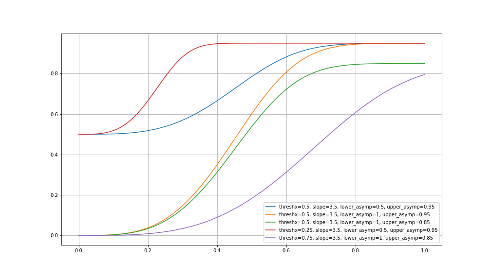
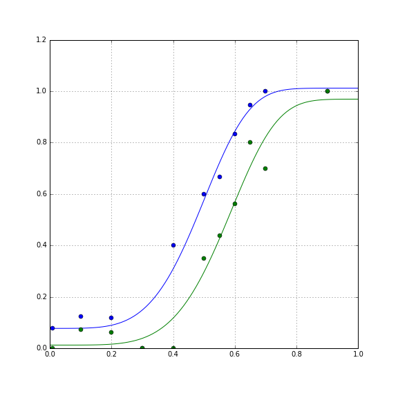
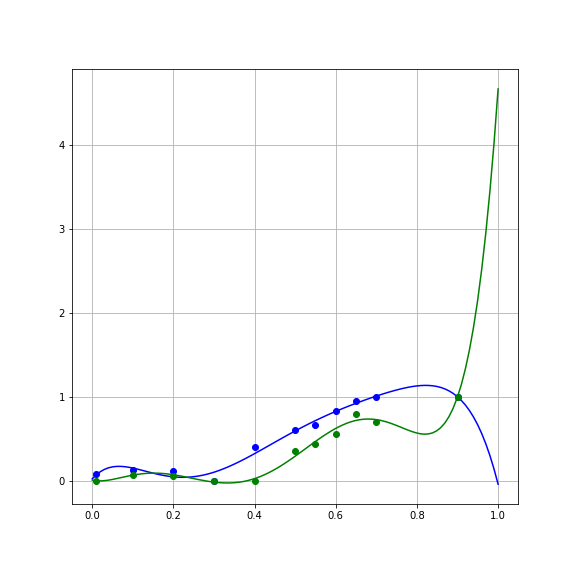

# Model evaluation with cross-validation

> ## Learning Objectives {.objectives}
>
> * Learners can define and identify overfitting.
> * Learners can implement split-half cross-validation to evaluate model error.

How do we know that a model is *good enough*?

In the previous section, we managed to reduce the SSE substantially relative to
the linear model, by fitting a non-linear, but it's still not perfect. How about
trying a more complicated model, with more parameters? Another function that is
often used to fit psychometric data is the Weibull cumulative distribution
function, named after the great Swedish mathematician and engineer [Waloddi
Weibull](http://en.wikipedia.org/wiki/Waloddi_Weibull)

~~~ {.python}

def weibull(x, threshx, slope, lower_asymp, upper_asymp):
    """
    The Weibull cumulative distribution function

    Parameters
    ----------
    x : float or array
       The values of x over which to evaluate the cumulative Weibull function

    threshx : float
       The value of x at the deflection point of the function.
       For a lower_asymp set to 0.5, this is at approximately y=0.81  

    slope : float
        The slope of the function at the deflection point.

    lower_asymp : float
        The lower asymptote of the function

    upper_asymp : float
        The upper asymptote of the function.
    """
    threshy = 1 - (lower_asymp * np.exp(-1))
    k = (-np.log((1 - threshy) / (lower_asymp))) ** (1 / slope)
    m = (lower_asymp + upper_asymp - 1) * np.exp(-(k * x / threshx) ** slope)
    return upper_asymp - m

~~~

As you can see, this function has several more parameters to account for
features of the data that may interest us.

Let's see what that might look like:

~~~ {.python}

fig, ax = plt.subplots(1)
ax.plot(x, weibull(x, 0.5, 3.5, 0.5, 0.95), label='threshx=0.5, slope=3.5, lower_asymp=0.5, upper_asymp=0.95')
ax.plot(x, weibull(x, 0.5, 3.5, 1, 0.95),  label='threshx=0.5, slope=3.5, lower_asymp=1, upper_asymp=0.95')
ax.plot(x, weibull(x, 0.5, 3.5, 1, 0.85), label='threshx=0.5, slope=3.5, lower_asymp=1, upper_asymp=0.85')
ax.plot(x, weibull(x, 0.25, 3.5, 0.5, 0.95), label='threshx=0.25, slope=3.5, lower_asymp=0.5, upper_asymp=0.95')
ax.plot(x, weibull(x, 0.75, 3.5, 1, 0.85), label='threshx=0.75, slope=3.5, lower_asymp=1, upper_asymp=0.85')
ax.grid('on')
fig.set_size_inches([14, 8])
plt.legend(loc='lower right')
~~~

We go ahead and fit this function as well, using `curve_fit`

~~~ {.python}

params_ortho, cov_ortho = opt.curve_fit(weibull, x_ortho, y_ortho)
params_para, cov_para = opt.curve_fit(weibull, x_para, y_para)
~~~

And examine the results:

~~~ {.python}

y_ortho_hat = weibull(x, params_ortho[0], params_ortho[1], params_ortho[2], params_ortho[3])
fig, ax = plt.subplots(1)
ax.plot(x, y_ortho_hat)
ax.plot(x_ortho, y_ortho, 'bo')

y_para_hat = weibull(x, params_para[0], params_para[1], params_para[2], params_para[3])
ax.plot(x, y_para_hat)
ax.plot(x_para, y_para, 'go')

ax.grid("on")
fig.set_size_inches([8, 8])

~~~

Calculating the error, we find that the SSE is smaller for this model:

~~~ {.python}

SSE_para = np.sum((weibull(x_para, params_para[0], params_para[1], params_para[2], params_para[3]) - y_para) ** 2)
SSE_ortho = np.sum((weibull(x_ortho, params_ortho[0], params_ortho[1], params_ortho[2], params_ortho[3]) - y_ortho) ** 2)

~~~

Should we switch over to this model? It seems to be doing better in fitting the data.

## Overfitting

One of the reasons we should be suspicious of the more accurate second model is
tha the Weibull function has more parameters. This is sometimes referred to as
the "degrees of freedom" of the model, and intuitively just means that the more
parameters a function has, the more adjustments you can make to the estimated y
values that you could consistently get across a range of x values. Let's examine
the most extreme case of that. Consider the case of fitting a polynomial of
degree 6 to these data (7 parameters, including $\beta_0$):

~~~ {.python}

beta_ortho = np.polyfit(x_ortho, y_ortho, 6)
beta_para = np.polyfit(x_para, y_para, 6)

~~~

This model has even smaller error on the data:

~~~ {.python}

SE_ortho = np.sum((y_ortho - np.polyval(beta_ortho, x_ortho))**2)
SSE_para = np.sum((y_para - np.polyval(beta_para, x_para))**2)

~~~

But examining the curves of the fits, you can see that it does some absurd
things in order to fit the data:

That is, it bends to match not only the large-scale trends in the data, but also
the noise associated with each data point. This match to the noise that
characterizes the sample is called "overfitting".

Overfitting generally becomes worse as a model becomes more flexible. This can
roughly be quantified by the number of parameters in the model. That is, a
polynomial of degree 6 will always fit the data more accurately than a
polynomial of degree 5, if only because of overfitting to the noise in the
sample.

> ## The bias-variance tradeoff {.callout}
>
>  The tradeoff between different levels of model complexity and different
> sources of error is known as the bias-variance tradeff. We will not go into
> more detailed explanations of this tradeoff here, but Scott Fortmann-Roe wrote
> an [essay](http://scott.fortmann-roe.com/docs/BiasVariance.html) that
> elegantly demonstrates the concepts invloved, and offers additional reading.

> ## Formal/paramteric model selection {.callout}
>
> An F-test can be used to compare models that are *nested*. That is, a model in
> which an additional set of (one or more) parameters is added to an existing
> model. In addition, a few metrics have been developed to compare different
> models (also models that are not nested) based on the SSE and the number of
> parameters. [These](http://en.wikipedia.org/wiki/Bayesian_information_criterion)
> [metrics](http://en.wikipedia.org/wiki/Akaike_information_criterion) generally
> penalize a model for having many parameters and reward it for getting small
> SSE. However, these methods generally have some underlying assumptions and are
> not that transparent to understand. For a nice exposition on how to use these
> methods see [this paper]() (excuse the paywall...). Also, if you are
> interested in more on this topic, [This discussion](http://stats.stackexchange.com/questions/20729/best-approach-for-model-selection-bayesian-or-cross-validation) on
> the stats stack exchange website is an excellent resource.

## Overcoming overfitting -- model selection with cross-validation

One strategy to overcome overfitting is by separating the noise in the data used
to fit the model from the noise in the data used to evaluate the model. This is
called "cross-validation". We fit the model to one sample, and then evaluate it
on another. If we haven't collected two separate samples, it might still be safe
to assume that the noise in every individual observation (in the case of these
experiments, each trial) is independent, and we can generate two samples by
splitting the data up into sub-samples. There are different ways to split up the
data, but in this case it makes sense to separately look at odd trials and at
even trials, minimizing serial order effects (such as how tired the person got).

We refer to the sample used for fitting the model as the "training set". Using
the training set, we find the parameters of the model

~~~ {.python}

ortho_1 = ortho[::2]
x_ortho_1, y_ortho_1, n_ortho_1 = transform_data(ortho_train)
params_ortho_1, cov_ortho_1 = opt.curve_fit(cumgauss, x_ortho_1, y_ortho_1)

~~~

The left-out sample is called the "testing set". We use this sample to calculate
the error:

~~~ {.python}

ortho_2 = ortho[1::2]
x_ortho_2, y_ortho_2, n_ortho_2 = transform_data(ortho_train)
SSE_ortho_2 = np.sum((cumgauss(x_ortho_2, params_ortho_1[0], params_ortho_1[1]) - y_ortho_2) ** 2)

~~~

In order for this to be cross-validation, we would want to also do it the other
way around: use set \#2 as the training set and evaluate on the set \#1 as the
testing set:

~~~ {.python}

params_ortho_2, cov_ortho_2 = opt.curve_fit(cumgauss, x_ortho_2, y_ortho_2)
SSE_ortho_1 = np.sum((cumgauss(x_ortho_1, params_ortho_2[0], params_ortho_2[1]) - y_ortho_1) ** 2)

~~~

To evaluate model over all

> ## K-fold cross-validation {.callout}
>
> This type of cross-validation is a special case of what we call "k-fold"
> cross-validation. In each iteration of this procedure $\frac{1/k}$ of the data
> is left out for evaulation and the remaining data is used for training. In
> this case, we are using 2-fold cross-validation, or what is sometimes called >
> "split-half cross-validation"

> ## Cross-validation  {.challenge}
>
> 1. Write the code to cross-validate the parallel condition (bonus points if
> you write a function that can do both without changes!)
> 2. Evaluate the Weibull model as well. Which model do you think is better?

Next, let's summarize the points we learned. We'll also see a list of resources for further learning about the topics we discussed.

[Click here for the next section](05-summary.html).
