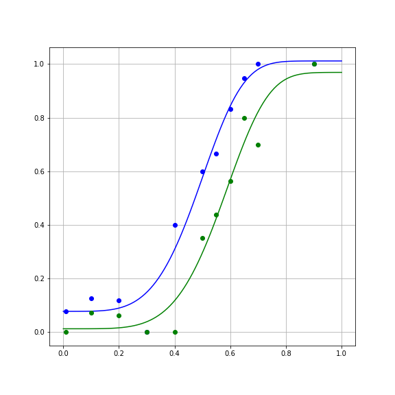

# Model evaluation with cross-validation

> ## Learning Objectives {.objectives}
>
> * Learners can define and identify overfitting.
> * Learners can use split-half cross-validation to evaluate model error.

How do we know that a model is *good enough*?

In the previous section, we managed to reduce the SSE substantially relative to
the linear model, by fitting a non-linear, but it's still not perfect. How about
trying a more complicated model, with more parameters? Another function that is
often used to fit psychometric data is the Weibull cumulative distribution
function, named after the great Swedish mathematician and engineer [Waloddi
Weibull](http://en.wikipedia.org/wiki/Waloddi_Weibull)

~~~ {.python}

def weibull(x, threshx, slope, lower_asymp, upper_asymp):
    """
    The Weibull cumulative distribution function

    Parameters
    ----------
    x : float or array
       The values of x over which to evaluate the cumulative Weibull function

    threshx : float
       The value of x at the deflection point of the function.
       For a lower_asymp set to 0.5, this is at approximately y=0.81  

    slope : float
        The slope of the function at the deflection point.

    lower_asymp : float
        The lower asymptote of the function

    upper_asymp : float
        The upper asymptote of the function.
    """
    threshy = 1 - (lower_asymp * np.exp(-1))
    k = (-np.log((1 - threshy) / (lower_asymp))) ** (1 / slope)
    m = (lower_asymp + upper_asymp - 1) * np.exp(-(k * x / threshx) ** slope)
    return upper_asymp - m

~~~

As you can see, this function has several more parameters to account for
features of the data that may interest us.

Let's see what that might look like:

~~~ {.python}

fig, ax = plt.subplots(1)
ax.plot(x, weibull(x, 0.5, 3.5, 0.5, 0.95), label='threshx=0.5, slope=3.5, lower_asymp=0.5, upper_asymp=0.95')
ax.plot(x, weibull(x, 0.5, 3.5, 1, 0.95),  label='threshx=0.5, slope=3.5, lower_asymp=1, upper_asymp=0.95')
ax.plot(x, weibull(x, 0.5, 3.5, 1, 0.85), label='threshx=0.5, slope=3.5, lower_asymp=1, upper_asymp=0.85')
ax.plot(x, weibull(x, 0.25, 3.5, 0.5, 0.95), label='threshx=0.25, slope=3.5, lower_asymp=0.5, upper_asymp=0.95')
ax.plot(x, weibull(x, 0.75, 3.5, 1, 0.85), label='threshx=0.75, slope=3.5, lower_asymp=1, upper_asymp=0.85')
ax.grid('on')
fig.set_size_inches([14, 8])
plt.legend(loc='lower right')
~~~

We go ahead and fit this function as well, using `curve_fit`

~~~ {.python}

params_ortho, cov_ortho = opt.curve_fit(weibull, x_ortho, y_ortho)
params_para, cov_para = opt.curve_fit(weibull, x_para, y_para)
~~~

And examine the results:

~~~ {.python}

y_ortho_hat = weibull(x, params_ortho[0], params_ortho[1], params_ortho[2], params_ortho[3])
fig, ax = plt.subplots(1)
ax.plot(x, y_ortho_hat)
ax.plot(x_ortho, y_ortho, 'bo')

y_para_hat = weibull(x, params_para[0], params_para[1], params_para[2], params_para[3])
ax.plot(x, y_para_hat)
ax.plot(x_para, y_para, 'go')

ax.grid("on")
fig.set_size_inches([8, 8])

~~~

Calculating the error, we find that the SSE is smaller for this model:

~~~ {.python}

SSE_para = np.sum((weibull(x_para, params_para[0], params_para[1], params_para[2], params_para[3]) - y_para) ** 2)
SSE_ortho = np.sum((weibull(x_ortho, params_ortho[0], params_ortho[1], params_ortho[2], params_ortho[3]) - y_ortho) ** 2)

~~~

Should we switch over to this model? It seems to be doing better in fitting the data.

## Overfitting

One of the reasons we should be suspicious of the more accurate second model is
tha the Weibull function has more parameters. This is sometimes referred to as
the "degrees of freedom" of the model, and intuitively just means that the more
parameters a function has, the more adjustments you can make to the estimated y
values that you could consistently get across a range of x values. Let's examine
the most extreme case of that. Consider the case of fitting a polynomial of
degree 6 to these data (7 parameters, including $\beta_0$):

~~~ {.python}

beta_ortho = np.polyfit(x_ortho, y_ortho, 6)
beta_para = np.polyfit(x_para, y_para, 6)

~~~

This model has even smaller error on the data:

~~~ {.python}

SE_ortho = np.sum((y_ortho - np.polyval(beta_ortho, x_ortho))**2)
SSE_para = np.sum((y_para - np.polyval(beta_para, x_para))**2)

~~~

But examining the curves of the fits, you can see that it does some absurd
things in order to fit the data:

That is, it bends to match not only the large-scale trends in the data, but also
the noise associated with each data point. This match to the noise that
characterizes the sample is called "overfitting".

## How to deal with overfitting, while allowing maximal model flexibility
