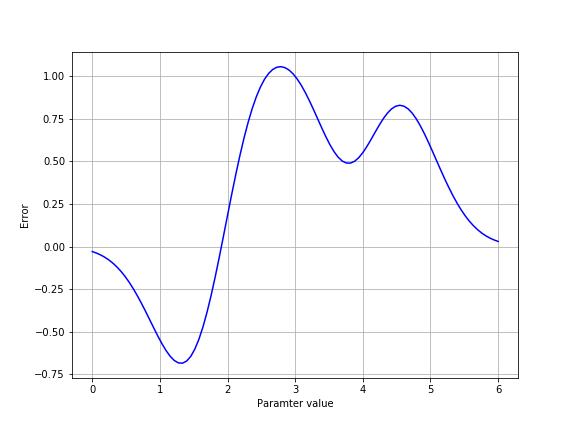

### Models are useful!

They summarize our data and allow us to explain it (build theories).

They allow us to predict what future data might look like.

> ## Cross-validation and prediction {.callout}
>
> Accuracy in cross-prediction is sometimes called predictive accuracy, because
> it tells us how accurate the model would be for samples that we did not use
> in fitting the model. In that sense, it is a test of the model on data that
> we haven't seen yet. May as well be in the future!

## Linear models are easy to fit.

If you can get away with a linear model, you should!

## Non-linear models are really not that hard (except when they are).

An important difference is the time it takes to fit a linear model (fast,
usually), relative to non-linear model (usually slow). This might become
crucial, if you have a lot of data.

Non-linear models are almost arbitrarily flexible, but very flexible models
might also be **under-determined**: this means that several different settings
of the parameters set the model to be almost equally accurate. Leo Breiman calls
this the "Rashomon effect".

Another thing to beware are so-called **local minima**. These are settings of
parameters that seem good, but only because all similar settings are worse.
There might be completely different settings that lead to an even better global minimum.

One way to overcome local minima is by running the model fit several times
with different initial conditions, finding the least error in all the different
runs. This can be done by using the `p0` key word argument when calling
`opt.curve_fit`.

> ## Default values  {.challenge}
>
> 1. What is the default value of `p0`?
> 2. Is it different when you use `opt.curve_fit` with `cumgauss` and when you
> use it with `weibull`?
> 3. Write a function that performs "grid search" in the space of the parameters
> of the cumulative Gaussian function, sampling all parts of the space of
> possible parameters.

## Check your model accuracy!

Cross-validation allows you to compare the accuracy of models that are very
different from each other.

For further readings on this topic, please go to the [reference](reference.html)
section of this lesson.
